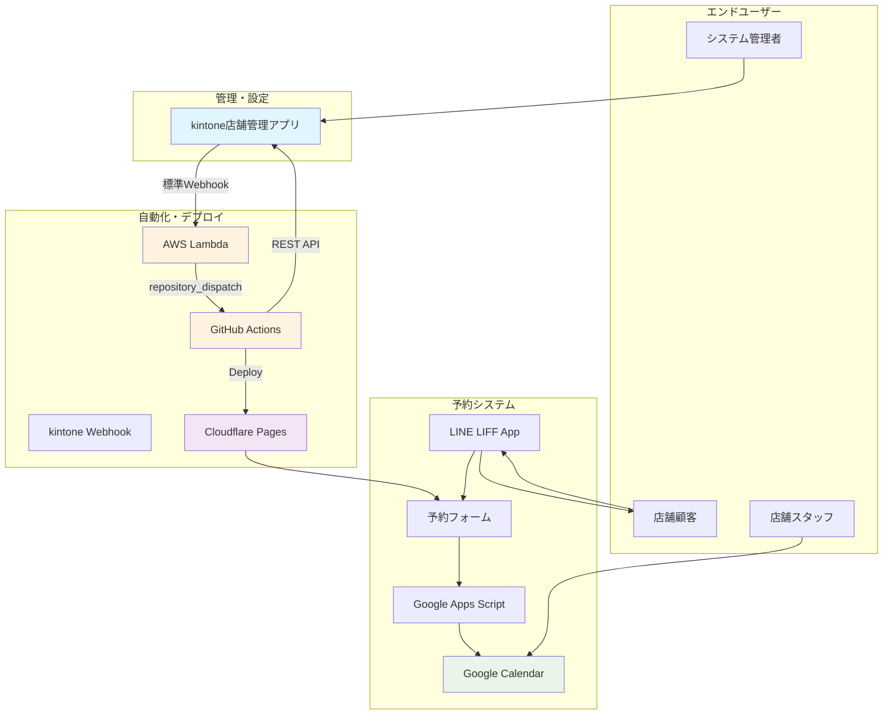
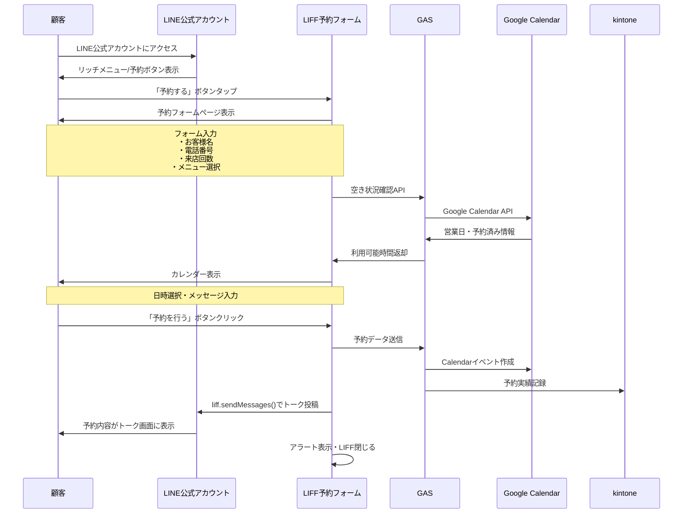
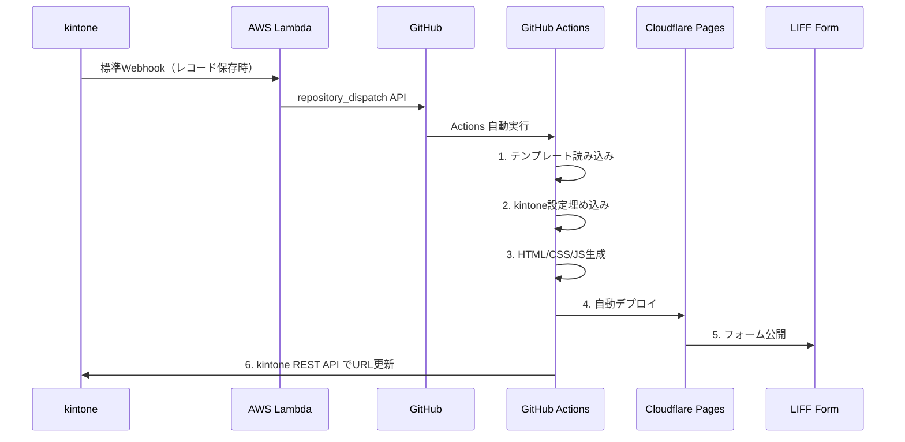

# kintone管理型予約システム 仕様書

## 概要

kintoneを中心とした管理画面により、1000店舗規模の予約システムを効率的に運用するシステムです。各店舗に専用の予約フォームURLを自動生成し、LIFF予約フォーム、Google Calendar管理、リアルタイム予約処理を実現します。

## システム全体図



## kintoneアプリ構成（最小構成）

### 1. 店舗管理アプリ

#### フィールド構成
```yaml
基本情報:
  store_id: 文字列（一行）- 一意キー【英語フィールドコード必須】
  store_name: 文字列（一行）【英語フィールドコード必須】
  phone: 文字列（一行）
  email: 文字列（一行）

システム情報:
  form_url: リンク（自動生成）【英語フィールドコード必須】
  status: ドロップダウン【英語フィールドコード必須】
    選択肢: pending/processing/active/error
    初期値: pending
  error_message: 文字列（複数行）【読み取り専用・英語フィールドコード必須】
  updated_at: 日時【読み取り専用・英語フィールドコード必須】

LINE連携設定:
  liff_id: 文字列（一行）【英語フィールドコード必須】

予約フォーム設定:
  menu_config: 文字列（複数行）- JSON形式【英語フィールドコード必須】⚠️重要
  business_hours: 文字列（複数行）- JSON形式【英語フィールドコード必須】⚠️重要
  primary_color: 文字列（一行）- HEXコード【英語フィールドコード必須】

⚠️ 重要: すべてのフィールドコードは英語名で設定してください
例: store_id, store_name, liff_id, menu_config, business_hours, primary_color

❌ NG: 店舗ID, 店舗名, LIFF_ID, メニュー構成, 営業時間
✅ OK: store_id, store_name, liff_id, menu_config, business_hours

🚨 フィールドタイプの重要な注意:
menu_config と business_hours は必ず「文字列（複数行）」で作成してください
❌ NG: チェックボックス、複数選択、ドロップダウン
✅ OK: 文字列（複数行）= MULTI_LINE_TEXT
```

#### 正しいデータ形式とバリデーション

##### メニュー構成（menu_config）の正しい形式
```json
[
  {"id": "cut", "name": "カット", "time": 60, "price": 5000},
  {"id": "color", "name": "カラー", "time": 120, "price": 8000},
  {"id": "perm", "name": "パーマ", "time": 90, "price": 7000}
]
```

##### 営業時間（business_hours）の正しい形式
```json
{
  "月": "9:00-18:00",
  "火": "9:00-18:00", 
  "水": "休み",
  "木": "9:00-18:00",
  "金": "9:00-18:00",
  "土": "9:00-17:00",
  "日": "10:00-16:00"
}
```

##### よくある入力ミス
```bash
❌ NG例（JSONではない文字列）:
menu_config: "sample1"
business_hours: "sample1,sample2"

❌ NG例（不正なJSON）:
menu_config: "{'id': 'cut'}"  # シングルクォートは無効
business_hours: "{月: '9:00'}"  # キーにクォートが必要

✅ OK例（正しいJSON）:
menu_config: '[{"id": "cut", "name": "カット", "time": 60, "price": 5000}]'
business_hours: '{"月": "9:00-18:00", "火": "9:00-18:00"}'
```

#### 自動化プロセス（実装版）
```yaml
レコード保存時:
  1. kintone標準Webhook → AWS Lambda
  2. Lambda → GitHub repository_dispatch API
  3. GitHub Actions → フォーム自動生成（3-5分）
  4. GitHub Actions → kintone REST API（URL更新）
```

## 重要：フィールドタイプエラーの修正

### 現在のフィールド設定で発生している問題

#### 問題の詳細

##### 1. フィールドタイプ問題（解決済み）
```bash
✅ 修正完了:
menu_config: MULTI_LINE_TEXT（文字列・複数行）- 正常動作
business_hours: MULTI_LINE_TEXT（文字列・複数行）- 正常動作

JSON形式のデータが正しく入力・解析されています
```

##### 2. GitHub API エラー 422（新しい問題）
```bash
❌ 現在のエラー:
GitHub API status: 422
メッセージ: "For 'links/0/schema', \"phone\" is not an object."

原因: client_payload のデータ構造が不正
- phone, email フィールドが予期しない形式で送信されている
- GitHub repository_dispatch API の仕様に合わない
```

#### 修正手順

##### 1. kintoneアプリでフィールドを再作成
```bash
手順:
1. アプリ設定 → フォームタブ
2. 既存の menu_config, business_hours フィールドを削除
3. 新しいフィールドを追加:

■ menu_config
- フィールドタイプ: 文字列（複数行）
- フィールド名: Menu Configuration  
- フィールドコード: menu_config
- 必須項目: チェック

■ business_hours  
- フィールドタイプ: 文字列（複数行）
- フィールド名: Business Hours
- フィールドコード: business_hours
- 必須項目: チェック

4. アプリを更新して保存
```

##### 3. Lambda関数での修正（GitHub API 422エラー対応）
```javascript
// GitHub repository_dispatch API 422エラーの修正
function buildGitHubPayload(record) {
    const storeId = record.store_id?.value || '';
    const storeName = record.store_name?.value || '';
    const liffId = record.liff_id?.value || '';
    const primaryColor = record.primary_color?.value || '#6600FF';
    
    // JSON文字列をパース
    let menuConfig = [];
    let businessHours = {};
    
    try {
        if (record.menu_config?.value) {
            const menuValue = record.menu_config.value.trim();
            if (menuValue.startsWith('[') && menuValue.endsWith(']')) {
                menuConfig = JSON.parse(menuValue);
            }
        }
    } catch (e) {
        console.log('Menu config parse error:', e);
        // デフォルト値を設定
        menuConfig = [
            {"id": "default", "name": "基本サービス", "time": 60, "price": 5000}
        ];
    }
    
    try {
        if (record.business_hours?.value) {
            const hoursValue = record.business_hours.value.trim();
            if (hoursValue.startsWith('{') && hoursValue.endsWith('}')) {
                businessHours = JSON.parse(hoursValue);
            }
        }
    } catch (e) {
        console.log('Business hours parse error:', e);
        // デフォルト値を設定
        businessHours = {
            "月": "9:00-18:00",
            "火": "9:00-18:00",
            "水": "休み",
            "木": "9:00-18:00",
            "金": "9:00-18:00",
            "土": "9:00-17:00",
            "日": "10:00-16:00"
        };
    }
    
    // GitHub API用のペイロード（phone, emailを除外）
    return {
        event_type: "deploy-form",
        client_payload: {
            record_id: record.$id?.value || '',
            store_id: storeId,
            store_name: storeName,
            liff_id: liffId,
            menu: menuConfig,
            business_hours: businessHours,
            primary_color: primaryColor
            // phone, email は GitHub API の client_payload から除外
        }
    };
}

// Lambda handler内での使用例
exports.handler = async (event) => {
    try {
        const kintoneRecord = JSON.parse(event.body).record;
        console.log('kintone record:', kintoneRecord);
        
        // GitHub APIペイロード構築
        const githubPayload = buildGitHubPayload(kintoneRecord);
        console.log('GitHub payload:', JSON.stringify(githubPayload, null, 2));
        
        // GitHub repository_dispatch API 呼び出し
        const response = await fetch('https://api.github.com/repos/YOUR_ORG/YOUR_REPO/dispatches', {
            method: 'POST',
            headers: {
                'Authorization': `token ${process.env.GITHUB_TOKEN}`,
                'Accept': 'application/vnd.github.v3+json',
                'Content-Type': 'application/json',
                'User-Agent': 'kintone-webhook-lambda'
            },
            body: JSON.stringify(githubPayload)
        });
        
        console.log('GitHub API status:', response.status);
        
        if (!response.ok) {
            const errorText = await response.text();
            console.log('GitHub API error:', errorText);
            throw new Error(`GitHub API error: ${response.status} - ${errorText}`);
        }
        
        return {
            statusCode: 200,
            body: JSON.stringify({ message: 'Success' })
        };
        
    } catch (error) {
        console.error('Lambda error:', error);
        return {
            statusCode: 500,
            body: JSON.stringify({ error: error.message })
        };
    }
};
```

## kintone JSON エラー対処法

### JSON Parse Error: Invalid JSON format

#### エラーの原因
```bash
エラー例1: GitHub API status: 422
原因: client_payload に不正なフィールドが含まれている
- phone, email フィールドが GitHub API の仕様に合わない
- GitHub repository_dispatch では client_payload は任意のJSONデータを許可するが、
  特定のフィールド名が予約語として扱われる場合がある

エラー例2: SyntaxError: Unexpected token 's', "sample1" is not valid JSON  
原因: menu_config や business_hours フィールドに正しいJSON形式でないデータが入力されている

よくある問題:
1. JSONではなく普通の文字列を入力: "sample1"
2. 不正なJSON形式: "{'key': 'value'}" （シングルクォート使用）
3. 配列・オブジェクト記号なし: "key: value"
4. GitHub API client_payload での予約フィールド名使用
```

#### 解決手順

##### 1. kintoneでの正しいデータ入力
```bash
■ menu_config フィールド（文字列・複数行）に入力:
[
  {"id": "cut", "name": "カット", "time": 60, "price": 5000},
  {"id": "color", "name": "カラー", "time": 120, "price": 8000}
]

■ business_hours フィールド（文字列・複数行）に入力:
{
  "月": "9:00-18:00",
  "火": "9:00-18:00",
  "水": "休み",
  "木": "9:00-18:00",
  "金": "9:00-18:00",
  "土": "9:00-17:00",
  "日": "10:00-16:00"
}

⚠️ 注意:
- ダブルクォート（"）を使用（シングルクォート'は無効）
- 配列は [ ] で囲む
- オブジェクトは { } で囲む
- 文字列値はダブルクォートで囲む
```

##### 2. JSON形式の検証方法
```bash
入力前の確認:
1. JSON Linter（jsonlint.com）でバリデーション
2. VS Code等のエディタでJSON形式チェック
3. ブラウザのコンソールでJSON.parse()テスト

例:
JSON.parse('[{"id": "cut", "name": "カット", "time": 60, "price": 5000}]')
→ エラーが出なければ正しいJSON
```

##### 4. GitHub API エラー確認方法
```bash
■ ログの確認手順:
1. Lambda CloudWatch Logs で詳細確認
2. GitHub API response の確認
3. client_payload の構造検証

■ よくあるGitHub API 422エラー:
- "phone" is not an object: phone フィールドを除外
- "email" is not an object: email フィールドを除外  
- Invalid JSON format: ペイロード構造を確認
- Repository not found: リポジトリ名・権限を確認

■ 修正方法:
client_payload からは店舗フォーム生成に必要な最小限のフィールドのみ送信:
✅ store_id, store_name, liff_id
✅ menu (配列), business_hours (オブジェクト)
✅ primary_color
❌ phone, email, Record_number, Updated_by など（除外）
```

### GAIA_NO01 エラー: API権限不足

#### エラーの原因
```bash
エラーコード: GAIA_NO01
メッセージ: "Using this API token, you cannot run the specified API."
原因: APIトークンに必要な権限が設定されていない
```

#### 解決手順
```bash
1. kintoneアプリ → アプリ設定 → API → APIトークン
2. 既存トークンを削除（セキュリティのため）
3. 新しいトークンを生成
4. 権限設定を正しく行う:
   ✅ レコード閲覧
   ✅ レコード編集  
   ✅ レコード追加（必要に応じて）
   ❌ レコード削除（不要）
   ✅ アプリ管理（必要に応じて）
5. 保存してトークンをコピー
6. GitHub Secretsの KINTONE_API_TOKEN を更新
```

#### 追加確認事項
```bash
■ アプリIDの確認:
- URLから確認: https://your-domain.cybozu.com/k/{APP_ID}/
- 数字部分がアプリID

■ ドメインの確認:
- 正しい形式: your-subdomain.cybozu.com
- 間違い例: https://your-subdomain.cybozu.com/

■ フィールドコードの確認:
- 英語名フィールドコードを使用
- 日本語フィールド名は使用不可

■ GitHub API の確認:
- リポジトリの存在確認
- GitHub Token の権限確認（repo スコープ必須）
- client_payload の構造確認
```

## フォーム自動生成システム（実装版）

### 1. kintone → Lambda → GitHub連携

#### 実際の連携フロー
```yaml
kintone標準Webhook設定:
  URL: https://YOUR_API_ID.execute-api.YOUR_REGION.amazonaws.com/prod/webhook
  HTTP Method: POST
  送信条件: レコード追加時・更新時
  
AWS Lambda処理:
  1. kintone Webhookデータ受信
  2. 必須フィールド検証
  3. GitHub repository_dispatch API呼び出し
  
GitHub Actions実行:
  1. repository_dispatch イベント受信
  2. テンプレートファイル処理
  3. Cloudflare Pages デプロイ
  4. kintone REST API でレコード更新

送信データ形式:
  {
    "event_type": "deploy-form",
    "client_payload": {
      "record_id": "123", 
      "store_id": "店舗ID",
      "store_name": "店舗名",
      "liff_id": "LIFF_ID",
      "menu": [メニュー配列],
      "business_hours": {営業時間},
      "primary_color": "#13ca5e"
    }
  }
```

### 2. フォーム生成プロセス

#### GitHub Actions ワークフロー
```yaml
name: Deploy LIFF Form

on:
  repository_dispatch:
    types: [deploy-form]

jobs:
  generate-form:
    runs-on: ubuntu-latest
    steps:
    - name: Generate form
      run: |
        # 1. テンプレート読み込み
        # 2. kintone設定値を埋め込み
        # 3. HTML/CSS/JS生成
        # 4. GitHub Pages / Cloudflare Pagesにデプロイ
        
    - name: Update kintone
      run: |
        # kintone REST API経由でレコード更新
        curl -X PUT "https://your-domain.cybozu.com/k/v1/record.json" \
          -H "X-Cybozu-API-Token: ${{ secrets.KINTONE_API_TOKEN }}" \
          -H "Content-Type: application/json" \
          -d '{
            "app": "${{ secrets.KINTONE_APP_ID }}",
            "id": "${{ github.event.client_payload.record_id }}",
            "record": {
              "予約フォームURL": {"value": "https://${{ github.event.client_payload.store_id }}.pages.dev"},
              "ステータス": {"value": "稼働中"}
            }
          }'
```

### 3. 生成される予約フォーム

#### 基本構造
```html
<!DOCTYPE html>
<html>
<head>
    <title>{{店舗名}} 予約フォーム</title>
    <style>
        :root { --primary-color: {{プライマリカラー}}; }
        /* 元フォームのCSS */
    </style>
</head>
<body>
    <h1>{{店舗名}}<br>予約フォーム</h1>
    
    <!-- メニュー選択（動的生成） -->
    <div class="menu-sections">
        {{#each メニュー}}
        <button onclick="selectMenu('{{id}}', {{time}}, {{price}})">
            {{name}} - {{time}}分 - ¥{{price}}
        </button>
        {{/each}}
    </div>
    
    <!-- カレンダー -->
    <div class="calendar-container"></div>
    
    <script>
        const LIFF_ID = '{{LIFF_ID}}';
        liff.init({ liffId: LIFF_ID });
        
        // 元フォームのJavaScript
        // 営業時間チェック、予約送信ロジック等
    </script>
</body>
</html>
```

## 予約システム連携

### 1. 顧客予約フロー

#### LINE公式アカウント → LIFF → 予約完了


### 2. LIFF予約フォーム生成システム

#### 店舗別フォームカスタマイズ
```yaml
kintone設定 → 自動生成される要素:

フォームヘッダー:
  店舗名: "美容室サクラ" → <h1>美容室サクラ<br>予約フォーム</h1>
  カラーテーマ: #13ca5e → CSS変数置換
  ロゴURL: 店舗ロゴ → タグ挿入

来店回数ボタン:
  設定: {"初めて": 30分, "2回目以降": 15分}
  生成: <button onclick="selectVisit()">初めて</button>
        <button onclick="selectVisit()">2回目以降</button>

メニューセクション:
  male/female/whitening セクション自動生成
  料金・時間・説明文をkintone設定から動的挿入

営業時間・定休日:
  カレンダー表示ロジックに反映
  空き状況判定ルールに使用

LIFF SDK設定:
  liff.init({ liffId: '店舗専用LIFF_ID' })
  liff.sendMessages() の送信先を店舗LINE設定
```

#### フォーム生成テンプレート
```html
<!-- 生成されるindex.htmlの構造 -->
<!DOCTYPE html>
<html lang="ja">
<head>
    <meta charset="UTF-8">
    <title>{{店舗名}} - 予約フォーム</title>
    <style>
        :root {
            --primary-color: {{プライマリカラー}};
            --secondary-color: {{セカンダリカラー}};
        }
        /* 元予約フォームのCSS + 動的カラー */
    </style>
</head>
<body>
    <div class="container">
        <h1>{{店舗名}}<br>予約フォーム</h1>
        
        <!-- 来店回数ボタン（kintone設定から生成） -->
        <div class="visit-buttons">
            {{#each 来店回数設定}}
            <button onclick="selectVisit(this, '{{time}}')">{{label}}</button>
            {{/each}}
        </div>
        
        <!-- メニューセクション（kintone設定から生成） -->
        {{#each メニュー構成}}
        <div id="{{@key}}" class="menu-section">
            <h3>{{label}}</h3>
            {{#each services}}
            <button onclick="selectMenu(this, '{{id}}', {{time}}, {{price}})">
                {{name}} - {{time}}分 - ¥{{price}}
            </button>
            {{/each}}
        </div>
        {{/each}}
        
        <!-- カレンダー -->
        <div class="calendar-container">
            <div class="calendar" id="calendar1"></div>
        </div>
        
        <!-- 送信ボタン -->
        <button class="submit-button" onclick="submitForm()">予約を行う</button>
    </div>
    
    <script src="https://static.line-scdn.net/liff/edge/2.1/sdk.js"></script>
    <script>
        // 店舗固有設定をJSに埋め込み
        const TENANT_CONFIG = {
            tenantId: '{{テナントID}}',
            liffId: '{{LIFF_ID}}',
            gasAvailabilityUrl: '{{GAS_Availability_URL}}',
            gasReservationUrl: '{{GAS_Reservation_URL}}',
            calendarId: '{{Calendar_ID}}',
            businessHours: {{営業時間}},
            holidays: {{定休日}},
            visitTimes: {{来店回数設定}},
            menuTimes: {{メニュー時間設定}}
        };
        
        // LIFF初期化
        liff.init({ liffId: TENANT_CONFIG.liffId });
        
        // 元予約フォームのJavaScript + 設定値置換
        async function fetchAvailability(date) {
            const response = await fetch(
                `${TENANT_CONFIG.gasAvailabilityUrl}?tenant=${TENANT_CONFIG.tenantId}&startTime=${startTime}&endTime=${endTime}`
            );
            return response.json();
        }
        
        async function submitForm() {
            // 予約データ送信
            await fetch(TENANT_CONFIG.gasReservationUrl, {
                method: 'POST',
                body: JSON.stringify({
                    tenantId: TENANT_CONFIG.tenantId,
                    ...formData
                })
            });
            
            // LINE トークに送信
            await liff.sendMessages([{
                type: 'text',
                text: `【予約フォーム】\nお名前：${name}\n電話番号：${phone}\n...`
            }]);
            
            alert('当日キャンセルは無いように...');
            liff.closeWindow();
        }
    </script>
</body>
</html>
```

### 4. 設定例

#### 設定例（正しいデータ形式）

##### kintoneレコード例（修正後）
```json
{
  "store_id": {"type": "SINGLE_LINE_TEXT", "value": "store001"},
  "store_name": {"type": "SINGLE_LINE_TEXT", "value": "サロン花子"},
  "liff_id": {"type": "SINGLE_LINE_TEXT", "value": "1234567890-abcdefgh"},
  "menu_config": {
    "type": "MULTI_LINE_TEXT", 
    "value": "[{\"id\": \"cut\", \"name\": \"カット\", \"time\": 60, \"price\": 5000}, {\"id\": \"color\", \"name\": \"カラー\", \"time\": 120, \"price\": 8000}]"
  },
  "business_hours": {
    "type": "MULTI_LINE_TEXT",
    "value": "{\"月\": \"9:00-18:00\", \"火\": \"9:00-18:00\", \"水\": \"休み\", \"木\": \"9:00-18:00\", \"金\": \"9:00-18:00\", \"土\": \"9:00-17:00\", \"日\": \"10:00-16:00\"}"
  },
  "primary_color": {"type": "SINGLE_LINE_TEXT", "value": "#ff6b6b"}
}
```

##### 現在のレコード例（MULTI_SELECT - 問題あり）
```json
{
  "menu_config": {
    "type": "MULTI_SELECT",
    "value": ["sample1"]  // ← これではJSON形式のデータを入力できない
  },
  "business_hours": {
    "type": "MULTI_SELECT", 
    "value": ["sample1", "sample2", "sample3"]  // ← これではJSON形式のデータを入力できない
  }
}
```

##### kintoneアプリでの入力例（修正後）
```bash
■ store_id フィールド:
store001

■ store_name フィールド:
サロン花子

■ liff_id フィールド:
1234567890-abcdefgh

■ menu_config フィールド（文字列・複数行）:
[
  {"id": "cut", "name": "カット", "time": 60, "price": 5000},
  {"id": "color", "name": "カラー", "time": 120, "price": 8000}
]

■ business_hours フィールド（文字列・複数行）:
{
  "月": "9:00-18:00",
  "火": "9:00-18:00",
  "水": "休み",
  "木": "9:00-18:00",
  "金": "9:00-18:00",
  "土": "9:00-17:00",
  "日": "10:00-16:00"
}

■ primary_color フィールド:
#ff6b6b

⚠️ 重要な変更点:
- menu_config と business_hours は「文字列（複数行）」フィールドで作成
- JSON形式の文字列を直接入力可能
- 複数選択フィールドは使用しない
```

##### 現在の問題のある設定
```bash
❌ 現在の設定（修正が必要）:

■ menu_config フィールド（複数選択）:
sample1  // ← 選択肢からしか選べない

■ business_hours フィールド（複数選択）:
sample1, sample2, sample3  // ← 選択肢からしか選べない

この設定では:
1. JSON形式のデータを入力できない
2. Lambda関数でparse errorが発生
3. 動的なメニュー設定ができない
```

### kintone入力時のコピー&ペースト用テンプレート

#### menu_config 入力用テンプレート集

##### 美容室・ヘアサロン向け
```json
[
  {"id": "cut", "name": "カット", "time": 60, "price": 5000},
  {"id": "color", "name": "カラー", "time": 120, "price": 8000},
  {"id": "perm", "name": "パーマ", "time": 90, "price": 7000},
  {"id": "treatment", "name": "トリートメント", "time": 45, "price": 3000},
  {"id": "shampoo", "name": "シャンプー・ブロー", "time": 30, "price": 2000}
]
```

##### エステサロン向け
```json
[
  {"id": "facial_basic", "name": "フェイシャル（ベーシック）", "time": 90, "price": 8000},
  {"id": "facial_premium", "name": "フェイシャル（プレミアム）", "time": 120, "price": 12000},
  {"id": "body_massage", "name": "ボディマッサージ", "time": 60, "price": 6000},
  {"id": "lymph_drainage", "name": "リンパドレナージュ", "time": 90, "price": 9000}
]
```

##### ネイルサロン向け
```json
[
  {"id": "manicure", "name": "マニキュア", "time": 60, "price": 4000},
  {"id": "gel_nail", "name": "ジェルネイル", "time": 90, "price": 6000},
  {"id": "nail_art", "name": "ネイルアート", "time": 120, "price": 8000},
  {"id": "nail_care", "name": "ネイルケア", "time": 45, "price": 3000}
]
```

##### マッサージ・整体向け
```json
[
  {"id": "relaxation", "name": "リラクゼーションマッサージ", "time": 60, "price": 5000},
  {"id": "deep_tissue", "name": "ディープティッシュマッサージ", "time": 90, "price": 7000},
  {"id": "thai_massage", "name": "タイ古式マッサージ", "time": 120, "price": 9000},
  {"id": "head_massage", "name": "ヘッドマッサージ", "time": 45, "price": 4000}
]
```

#### business_hours 入力用テンプレート集

##### 一般的な営業時間（月-土営業、日曜定休）
```json
{
  "月": "9:00-18:00",
  "火": "9:00-18:00",
  "水": "9:00-18:00",
  "木": "9:00-18:00",
  "金": "9:00-18:00",
  "土": "9:00-17:00",
  "日": "休み"
}
```

##### 週休2日制（水・日定休）
```json
{
  "月": "10:00-19:00",
  "火": "10:00-19:00",
  "水": "休み",
  "木": "10:00-19:00",
  "金": "10:00-19:00",
  "土": "9:00-18:00",
  "日": "休み"
}
```

##### 夜間営業対応（火曜定休）
```json
{
  "月": "10:00-20:00",
  "火": "休み",
  "水": "10:00-20:00",
  "木": "10:00-20:00",
  "金": "10:00-21:00",
  "土": "9:00-20:00",
  "日": "9:00-18:00"
}
```

##### 不定休対応
```json
{
  "月": "10:00-18:00",
  "火": "10:00-18:00",
  "水": "10:00-18:00",
  "木": "休み",
  "金": "10:00-18:00",
  "土": "9:00-17:00",
  "日": "10:00-16:00"
}
```

#### 入力時の注意点
```bash
⚠️ 必ず確認してください:
1. JSON形式の正確性:
   - ダブルクォート（"）を使用
   - カンマ（,）を忘れずに
   - 最後の要素にはカンマ不要

2. 文字化けの防止:
   - コピペ時に全角スペースが混入しないよう注意
   - 改行コードの確認

3. バリデーション:
   - 入力前にJSONlintなどで検証推奨
   - ブラウザのコンソールでJSON.parse()テスト

✅ 検証コマンド例:
JSON.parse('[{"id": "cut", "name": "カット", "time": 60, "price": 5000}]')
→ エラーが出なければOK
```

#### 生成される予約フォーム例
```
https://store001.your-domain.com/
├── index.html（メインフォーム）
├── style.css（店舗カラー適用済み）
└── script.js（LIFF_ID設定済み）
```

### 5. デプロイ完了後の流れ

1. **kintone側で確認**
   - レコードのURLフィールドに生成されたフォームURLが自動入力
   - 状態が「デプロイ完了」に更新

2. **LINE側での設定**
   - 生成されたフォームURLをLIFFアプリのEndpoint URLに設定
   - LINE公式アカウントのリッチメニューなどからリンク

3. **動作確認**
   - LIFFアプリ経由での予約フォームアクセス
   - 予約完了後のLINEメッセージ送信テスト

### 6. 今後の拡張可能性

#### 最小構成から追加可能な機能
- 複数店舗管理（店舗グループ機能）
- 予約状況リアルタイム同期
- 顧客管理機能
- 売上レポート機能
- 在庫・スタッフ管理連携

---

## システム構成の特徴

### 最小構成での設計原則
```yaml
シンプルな連携フロー:
  kintone → GitHub Actions → Cloudflare Pages
  
不要なサービスを排除:
  ❌ AWS Lambda（サーバーレス処理不要）
  ❌ SQS Queue（非同期処理不要）
  ❌ DynamoDB（状態管理不要）
  ❌ 複雑な進捗監視

必要最小限のサービス:
  ✅ kintone（店舗設定管理）
  ✅ GitHub Actions（フォーム自動生成）
  ✅ Cloudflare Pages（静的サイトホスティング）
  ✅ LIFF（LINE予約フォーム）
  ✅ Google Apps Script（予約処理）
```

### 簡略化された連携フロー（実装版）


## kintone API設定の詳細

### 1. 正しいAPIトークン設定

#### 権限設定（重要）
```bash
必須権限:
✅ レコード閲覧: GitHub Actionsでレコード情報読み取り用
✅ レコード編集: フォームURL・ステータス更新用
✅ レコード追加: 必要に応じて（通常は不要）

オプション権限:
✅ アプリ管理: フィールド設定確認用（開発時のみ）
❌ レコード削除: セキュリティのため無効

注意事項:
- 権限不足だと GAIA_NO01 エラーが発生
- 過剰な権限は避ける（最小権限の原則）
```

#### GitHub Secrets設定値
```bash
■ KINTONE_API_TOKEN
値: 上記手順で生成したAPIトークン
例: abcd1234efgh5678ijkl90mnopqr

■ KINTONE_DOMAIN  
値: サブドメイン.cybozu.com（https://は不要）
例: your-company.cybozu.com

■ KINTONE_APP_ID
値: アプリの数字ID
例: 123
確認方法: アプリURLの数字部分
```

## kintone更新の仕組み

### 1. URL更新プロセス

#### GitHub Actions から kintone への逆方向連携
```yaml
実装方法:
  1. kintone API Token を GitHub Secrets に設定
  2. GitHub Actions 最終ステップでkintone REST API呼び出し
  3. 生成されたURL・ステータスを該当レコードに更新

必要な設定:
  GitHub Secrets:
    - KINTONE_API_TOKEN: kintoneアプリのAPIトークン
    - KINTONE_APP_ID: 店舗管理アプリのID
    - KINTONE_DOMAIN: your-domain.cybozu.com
```

#### 詳細なワークフロー例
```yaml
name: Deploy LIFF Form

on:
  repository_dispatch:
    types: [deploy-form]

env:
  STORE_ID: ${{ github.event.client_payload.store_id }}
  RECORD_ID: ${{ github.event.client_payload.record_id }}

jobs:
  generate-and-deploy:
    runs-on: ubuntu-latest
    steps:
    
    - name: Checkout repository
      uses: actions/checkout@v3
      
    - name: Generate form files
      run: |
        # Handlebars等でテンプレート処理
        mkdir -p dist/${STORE_ID}
        npx handlebars template.hbs \
          --data <(echo '${{ toJson(github.event.client_payload) }}') \
          --output dist/${STORE_ID}/index.html
          
    - name: Deploy to Cloudflare Pages
      uses: cloudflare/pages-action@v1
      with:
        apiToken: ${{ secrets.CLOUDFLARE_API_TOKEN }}
        accountId: ${{ secrets.CLOUDFLARE_ACCOUNT_ID }}
        projectName: ${STORE_ID}-booking
        directory: dist/${STORE_ID}
        
    - name: Update kintone record
      run: |
        FORM_URL="https://${STORE_ID}.pages.dev"
        
        curl -X PUT "https://${{ secrets.KINTONE_DOMAIN }}/k/v1/record.json" \
          -H "X-Cybozu-API-Token: ${{ secrets.KINTONE_API_TOKEN }}" \
          -H "Content-Type: application/json" \
          -d "{
            \"app\": \"${{ secrets.KINTONE_APP_ID }}\",
            \"id\": \"${RECORD_ID}\",
            \"record\": {
              \"予約フォームURL\": {\"value\": \"${FORM_URL}\"},
              \"ステータス\": {\"value\": \"稼働中\"},
              \"更新日時\": {\"value\": \"$(date -Iseconds)\"}
            }
          }"
        
    - name: Notify on failure
      if: failure()
      run: |
        # エラー時はステータスを「エラー」に更新
        curl -X PUT "https://${{ secrets.KINTONE_DOMAIN }}/k/v1/record.json" \
          -H "X-Cybozu-API-Token: ${{ secrets.KINTONE_API_TOKEN }}" \
          -H "Content-Type: application/json" \
          -d "{
            \"app\": \"${{ secrets.KINTONE_APP_ID }}\",
            \"id\": \"${RECORD_ID}\",
            \"record\": {
              \"ステータス\": {\"value\": \"エラー\"},
              \"エラー内容\": {\"value\": \"フォーム生成に失敗しました\"}
            }
          }"
```

### 2. kintone側の準備（改訂版）

#### 必要なAPIトークン設定
```yaml
kintone アプリ設定手順:
  1. 「アプリの設定」→「API」→「APIトークン」
  2. 既存トークンがある場合は削除
  3. 「生成する」をクリック
  4. 権限設定:
     ✅ レコード閲覧: 必須
     ✅ レコード編集: 必須（URL更新用）
     ❌ レコード追加: 通常不要
     ❌ レコード削除: セキュリティのため無効
  5. 「保存」をクリック
  6. 生成されたトークンをコピー
  7. GitHub Secrets に KINTONE_API_TOKEN として設定

注意事項:
  - トークンは一度しか表示されない
  - 権限変更時は新しいトークンを生成
  - 定期的なローテーション推奨（年1回程度）
```

#### Webhook設定（標準機能使用）
```yaml
設定手順:
  1. 「アプリの設定」→「外部サービス連携」→「Webhook」
  2. 「追加する」をクリック
  3. 設定内容:
     - 名前: Lambda Proxy
     - URL: https://YOUR_API_ID.execute-api.YOUR_REGION.amazonaws.com/prod/webhook
     - HTTPヘッダ: Content-Type: application/json
     - 送信条件:
       ✅ レコード追加時
       ✅ レコード更新時
     - 有効: ✅
  4. 「保存」をクリック

送信条件の詳細設定（オプション）:
  (record.store_id.value !== "") && (record.liff_id.value !== "")
  # 必須フィールドが入力されている場合のみ送信
```

#### よくあるエラーと対処法
```yaml
■ JSON Parse Error: Invalid JSON format
対処: menu_config, business_hours フィールドの正しいJSON形式入力

■ GAIA_NO01: API権限不足
対処: APIトークンの権限設定を確認・修正

■ GAIA_RE01: レコードが見つからない  
対処: KINTONE_APP_ID の値を確認

■ GAIA_DA02: 不正なドメイン
対処: KINTONE_DOMAIN の形式確認（https://は不要）

■ GAIA_AP01: アプリにアクセスできない
対処: APIトークンが正しいアプリで生成されているか確認

■ CB_NO02: フィールドコードが無効
対処: 英語フィールドコード使用、日本語名は不可

■ Lambda Function Error: Missing required fields
対処: store_id, liff_id が正しく入力されているか確認
```

#### Webhook設定の修正
```javascript
// kintone Webhook送信時にレコードIDも含める
kintone.events.on('app.record.create.submit.success', function(event) {
  const record = event.record;
  const recordId = event.recordId;
  
  // GitHub repository_dispatch 送信
  fetch('https://api.github.com/repos/your-org/line-forms/dispatches', {
    method: 'POST',
    headers: {
      'Authorization': 'token YOUR_GITHUB_TOKEN',
      'Accept': 'application/vnd.github.v3+json',
      'Content-Type': 'application/json'
    },
    body: JSON.stringify({
      event_type: 'deploy-form',
      client_payload: {
        record_id: recordId,  // ←重要：レコードIDを含める
        store_id: record.店舗ID.value,
        store_name: record.店舗名.value,
        liff_id: record.LIFF_ID.value,
        menu: JSON.parse(record.メニュー構成.value),
        business_hours: JSON.parse(record.営業時間.value),
        primary_color: record.プライマリカラー.value
      }
    })
  });
  
  return event;
});
```

### 3. エラーハンドリング

#### GitHub Actions でのエラー処理
```yaml
失敗パターンと対応:
  1. デプロイ失敗:
     - kintoneステータス: "エラー"
     - エラー内容フィールドに詳細記録
     
  2. kintone更新失敗:
     - GitHub Actions ログに記録
     - Slack通知等で管理者に連絡
     
  3. 部分的失敗:
     - フォームは生成されたがURL更新失敗
     - 手動でURLをkintoneに入力
```
