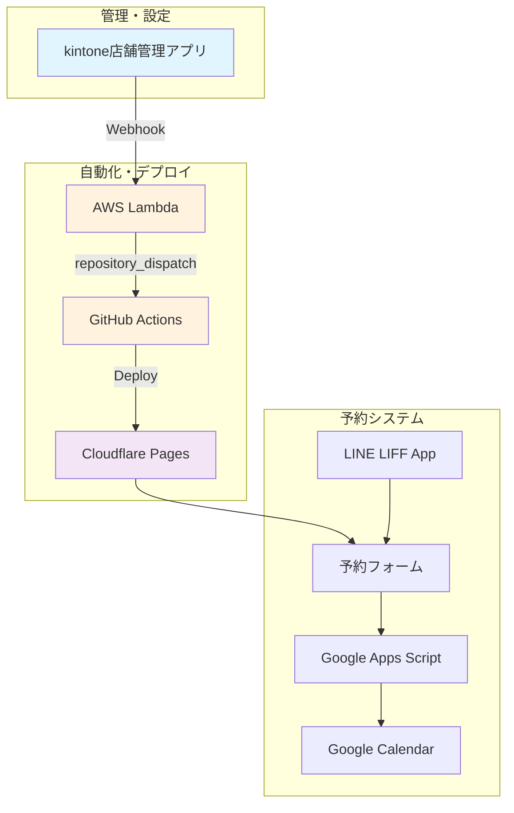

# kintone予約システム 完全設定ガイド

## 概要

kintoneで店舗情報を管理し、自動でLIFF予約フォームを生成・デプロイするシステムの完全設定手順です。

## システム構成図



---

## Phase 1: 事前準備

### 必要なアカウント・サービス
```yaml
必須アカウント:
  ✅ kintone（サイボウズ）
  ✅ GitHub（Personal or Organization）
  ✅ Cloudflare（無料プラン可）
  ✅ AWS（Lambda + API Gateway用）
  ✅ LINE Developers（LIFF用）

オプション:
  - Google Cloud Platform（GAS・Calendar用）
  - 独自ドメイン（.pages.devで十分）
```

---

## Phase 2: kintone設定

### 2.1 アプリ作成

#### フィールド設定
```yaml
アプリ名: Store Management System

フィールド構成:
  store_id: 文字列（一行）【必須・重複禁止】
  store_name: 文字列（一行）【必須】
  phone: 文字列（一行）
  email: 文字列（一行）
  liff_id: 文字列（一行）【必須】
  form_url: リンク【読み取り専用】
  status: ドロップダウン
    選択肢: pending/processing/active/error
    初期値: pending
  menu_config: 文字列（複数行）
  business_hours: 文字列（複数行）
  primary_color: 文字列（一行）
  error_message: 文字列（複数行）【読み取り専用】
  updated_at: 日時【読み取り専用】
```

### 2.2 APIトークン作成

```bash
1. アプリ設定 → API → APIトークン
2. 「生成する」をクリック
3. 権限設定:
   - レコード閲覧: ✅
   - レコード編集: ✅
   - レコード追加: ❌
   - レコード削除: ❌
4. 説明: "GitHub Actions用"
5. トークンをメモ（後でGitHub Secretsで使用）
```

---

## Phase 3: AWS Lambda設定

### 3.1 Lambda関数作成

#### 基本設定
```bash
1. AWS Console → Lambda → 関数の作成
2. 設定:
   - 関数名: kintone-github-proxy
   - ランタイム: Node.js 20.x
   - アーキテクチャ: x86_64
3. 「関数の作成」をクリック
```

#### Lambda関数コード
```javascript
const https = require('https');

exports.handler = async (event) => {
    console.log('Received event:', JSON.stringify(event, null, 2));
    
    try {
        // kintone標準Webhookデータを解析
        const body = JSON.parse(event.body);
        const record = body.record;
        const recordId = body.recordId;
        
        console.log('kintone record:', record);
        
        // 必須フィールドの確認
        if (!record.store_id || !record.store_id.value || 
            !record.liff_id || !record.liff_id.value) {
            console.log('Missing required fields');
            return {
                statusCode: 400,
                headers: {
                    'Content-Type': 'application/json',
                    'Access-Control-Allow-Origin': '*'
                },
                body: JSON.stringify({
                    success: false,
                    error: 'Missing required fields: store_id or liff_id'
                })
            };
        }
        
        // JSON文字列フィールドのパース
        let menuConfig = [];
        let businessHours = {};
        
        try {
            if (record.menu_config && record.menu_config.value) {
                menuConfig = JSON.parse(record.menu_config.value);
            }
        } catch (e) {
            console.log('Menu config parse error:', e);
        }
        
        try {
            if (record.business_hours && record.business_hours.value) {
                businessHours = JSON.parse(record.business_hours.value);
            }
        } catch (e) {
            console.log('Business hours parse error:', e);
        }
        
        // GitHub API用のペイロード作成
        const githubPayload = {
            event_type: 'deploy-form',
            client_payload: {
                record_id: recordId,
                store_id: record.store_id.value,
                store_name: record.store_name ? record.store_name.value : '',
                liff_id: record.liff_id.value,
                menu: menuConfig,
                business_hours: businessHours,
                primary_color: record.primary_color ? record.primary_color.value : '#007bff',
                phone: record.phone ? record.phone.value : '',
                email: record.email ? record.email.value : ''
            }
        };
        
        console.log('GitHub payload:', JSON.stringify(githubPayload, null, 2));
        
        // GitHub API呼び出し
        const result = await callGitHubAPI(githubPayload);
        
        if (result.success) {
            return {
                statusCode: 200,
                headers: {
                    'Content-Type': 'application/json',
                    'Access-Control-Allow-Origin': '*'
                },
                body: JSON.stringify({
                    success: true,
                    message: 'GitHub Actions triggered successfully'
                })
            };
        } else {
            return {
                statusCode: 500,
                headers: {
                    'Content-Type': 'application/json',
                    'Access-Control-Allow-Origin': '*'
                },
                body: JSON.stringify({
                    success: false,
                    error: result.error
                })
            };
        }
        
    } catch (error) {
        console.error('Lambda Error:', error);
        return {
            statusCode: 500,
            headers: {
                'Content-Type': 'application/json',
                'Access-Control-Allow-Origin': '*'
            },
            body: JSON.stringify({
                success: false,
                error: error.message
            })
        };
    }
};

async function callGitHubAPI(payload) {
    return new Promise((resolve, reject) => {
        const data = JSON.stringify(payload);
        
        const options = {
            hostname: 'api.github.com',
            port: 443,
            path: `/repos/${process.env.GITHUB_REPO}/dispatches`,
            method: 'POST',
            headers: {
                'Authorization': `token ${process.env.GITHUB_TOKEN}`,
                'Accept': 'application/vnd.github.v3+json',
                'Content-Type': 'application/json',
                'Content-Length': data.length,
                'User-Agent': 'kintone-github-proxy'
            }
        };
        
        const req = https.request(options, (res) => {
            console.log(`GitHub API status: ${res.statusCode}`);
            
            let responseBody = '';
            res.on('data', (chunk) => {
                responseBody += chunk;
            });
            
            res.on('end', () => {
                if (res.statusCode === 204) {
                    resolve({ success: true });
                } else {
                    console.log('GitHub API response:', responseBody);
                    resolve({ 
                        success: false, 
                        error: `GitHub API returned ${res.statusCode}: ${responseBody}` 
                    });
                }
            });
        });
        
        req.on('error', (error) => {
            console.error('Request error:', error);
            resolve({ success: false, error: error.message });
        });
        
        req.write(data);
        req.end();
    });
}
```

### 3.2 Lambda環境変数設定

```bash
1. Lambda関数画面 → 設定 → 環境変数
2. 編集をクリック
3. 環境変数を追加:

   キー: GITHUB_TOKEN
   値: ghp_xxxxxxxxxxxxxxxxxxxx
   説明: GitHub Personal Access Token
   
   キー: GITHUB_REPO  
   値: your-username/line-forms
   説明: GitHubリポジトリ名（owner/repo形式）

4. 保存
```

#### GitHub Personal Access Token作成
```bash
1. GitHub → Settings → Developer settings
2. Personal access tokens → Tokens (classic)
3. Generate new token → Generate new token (classic)
4. 設定:
   - Note: kintone-lambda-integration
   - Expiration: 1 year
   - Select scopes:
     ✅ repo (Full control of private repositories)
     ✅ workflow (Update GitHub Action workflows)
5. Generate token
6. トークンをコピー（再表示不可のため注意）
```

### 3.3 API Gateway設定

```bash
1. AWS Console → API Gateway → APIを作成
2. REST API → 構築
3. 設定:
   - API名: kintone-webhook-api
   - 説明: kintone to GitHub webhook proxy
   - エンドポイントタイプ: リージョン
4. 作成

5. リソース作成:
   - アクション → リソースの作成
   - リソース名: webhook
   - リソースパス: /webhook

6. メソッド作成:
   - /webhook リソース選択
   - アクション → メソッドの作成
   - メソッド: POST
   - 統合タイプ: Lambda関数
   - Lambdaプロキシ統合の使用: ✅
   - Lambda関数: kintone-github-proxy

7. CORS設定:
   - /webhook リソース選択
   - アクション → CORSの有効化
   - Access-Control-Allow-Origin: *

8. API デプロイ:
   - アクション → APIのデプロイ
   - ステージ名: prod

9. URLをメモ: https://xxxxxxxxxx.execute-api.ap-northeast-1.amazonaws.com/prod
```

### 3.4 kintone Webhook設定

```bash
1. kintoneアプリ → アプリ設定 → 外部サービス連携 → Webhook
2. 「追加する」をクリック
3. Webhook設定:
   - 名前: Lambda Proxy
   - URL: https://YOUR_API_ID.execute-api.YOUR_REGION.amazonaws.com/prod/webhook
   - HTTPヘッダ: Content-Type: application/json
   - 送信条件:
     - レコード追加時: ✅
     - レコード更新時: ✅
   - 有効: ✅
4. 保存
```

---

## Phase 4: GitHub設定

### 4.1 リポジトリ作成

#### 構造
```
line-forms/
├── .github/
│   └── workflows/
│       └── deploy-form.yml
├── templates/
│   ├── index.hbs
│   ├── style.css
│   └── script.js
├── dist/
└── README.md
```

### 4.2 GitHub Secrets設定

#### 必須設定
```bash
リポジトリ → Settings → Secrets and variables → Actions

設定するSecrets:
■ CLOUDFLARE_API_TOKEN
■ CLOUDFLARE_ACCOUNT_ID
■ KINTONE_API_TOKEN
■ KINTONE_DOMAIN
■ KINTONE_APP_ID

オプション（独自ドメイン使用時）:
■ CLOUDFLARE_ZONE_ID
```

### 4.3 GitHub Actionsワークフロー

#### .github/workflows/deploy-form.yml
```yaml
name: Deploy LIFF Form

on:
  repository_dispatch:
    types: [deploy-form]

env:
  STORE_ID: ${{ github.event.client_payload.store_id }}
  RECORD_ID: ${{ github.event.client_payload.record_id }}

jobs:
  generate-and-deploy:
    runs-on: ubuntu-latest
    
    steps:
    - name: Checkout repository
      uses: actions/checkout@v4
      
    - name: Setup Node.js
      uses: actions/setup-node@v4
      with:
        node-version: '18'
        
    - name: Install dependencies
      run: |
        npm install -g handlebars-cli
        
    - name: Generate form files
      run: |
        # ディレクトリ作成
        mkdir -p dist/${STORE_ID}
        
        # テンプレートデータ作成
        echo '${{ toJson(github.event.client_payload) }}' > data.json
        
        # HTML生成
        handlebars templates/index.hbs \
          --data data.json \
          --output dist/${STORE_ID}/index.html
          
        # CSS・JS複製
        cp templates/style.css dist/${STORE_ID}/
        cp templates/script.js dist/${STORE_ID}/
        
        # 設定値をJSに埋め込み
        sed -i "s/{{LIFF_ID}}/${{ github.event.client_payload.liff_id }}/g" dist/${STORE_ID}/script.js
        sed -i "s/{{STORE_ID}}/${STORE_ID}/g" dist/${STORE_ID}/script.js
        
    - name: Deploy to Cloudflare Pages
      uses: cloudflare/pages-action@v1
      with:
        apiToken: ${{ secrets.CLOUDFLARE_API_TOKEN }}
        accountId: ${{ secrets.CLOUDFLARE_ACCOUNT_ID }}
        projectName: line-forms-booking
        directory: dist/${STORE_ID}
        gitHubToken: ${{ secrets.GITHUB_TOKEN }}
        
    - name: Update kintone record (Success)
      if: success()
      run: |
        FORM_URL="https://line-forms-booking.pages.dev"
        
        curl -X PUT "https://${{ secrets.KINTONE_DOMAIN }}/k/v1/record.json" \
          -H "X-Cybozu-API-Token: ${{ secrets.KINTONE_API_TOKEN }}" \
          -H "Content-Type: application/json" \
          -d "{
            \"app\": \"${{ secrets.KINTONE_APP_ID }}\",
            \"id\": \"${RECORD_ID}\",
            \"record\": {
              \"form_url\": {\"value\": \"${FORM_URL}\"},
              \"status\": {\"value\": \"active\"},
              \"updated_at\": {\"value\": \"$(date -Iseconds)\"},
              \"error_message\": {\"value\": \"\"}
            }
          }"
          
    - name: Update kintone record (Failure)
      if: failure()
      run: |
        curl -X PUT "https://${{ secrets.KINTONE_DOMAIN }}/k/v1/record.json" \
          -H "X-Cybozu-API-Token: ${{ secrets.KINTONE_API_TOKEN }}" \
          -H "Content-Type: application/json" \
          -d "{
            \"app\": \"${{ secrets.KINTONE_APP_ID }}\",
            \"id\": \"${RECORD_ID}\",
            \"record\": {
              \"status\": {\"value\": \"error\"},
              \"error_message\": {\"value\": \"フォーム生成またはデプロイに失敗しました\"},
              \"updated_at\": {\"value\": \"$(date -Iseconds)\"}
            }
          }"
```

---

## Phase 5: Cloudflare設定

### 5.1 Pages設定

#### 初期設定
```bash
1. Cloudflareアカウント作成・ログイン
2. Pages → Create a project → Connect to Git
3. GitHub連携・リポジトリ選択: line-forms
4. Build Configuration:
   - Project name: line-forms-booking
   - Production branch: main
   - Framework preset: None
   - Build command: （空白）
   - Build output directory: dist
```

### 5.2 API Token作成

#### 設定手順
```bash
1. プロフィール → API Tokens → Create Token
2. Custom token設定:
   - Token name: GitHub Actions Deploy
   - Permissions:
     ✅ Account | Cloudflare Pages | Edit
     ✅ Zone | Zone | Read（独自ドメイン時）
     ✅ Zone | Zone Settings | Edit（独自ドメイン時）
   - Account Resources: Include All accounts
3. トークンをコピー
```

#### 必要なID確認
```bash
■ Account ID: ダッシュボード右下に表示
■ Zone ID: 独自ドメイン使用時のみ必要
```

---

## Phase 6: テンプレートファイル作成

### 6.1 基本テンプレート

#### templates/index.hbs
```html
<!DOCTYPE html>
<html lang="ja">
<head>
    <meta charset="UTF-8">
    <meta name="viewport" content="width=device-width, initial-scale=1.0">
    <title>{{store_name}} - 予約フォーム</title>
    <link rel="stylesheet" href="style.css">
    <style>
        :root {
            --primary-color: {{primary_color}};
        }
    </style>
</head>
<body>
    <div class="container">
        <header>
            <h1>{{store_name}}<br>予約フォーム</h1>
        </header>
        
        <main>
            <!-- 来店回数選択 -->
            <section class="visit-section">
                <h2>来店回数</h2>
                <div class="button-group">
                    <button type="button" class="visit-btn" data-time="30">初めて</button>
                    <button type="button" class="visit-btn" data-time="15">2回目以降</button>
                </div>
            </section>
            
            <!-- メニュー選択 -->
            <section class="menu-section">
                <h2>メニュー選択</h2>
                <div class="menu-list">
                    {{#each menu}}
                    <button type="button" class="menu-btn" 
                            data-id="{{id}}" 
                            data-time="{{time}}" 
                            data-price="{{price}}">
                        {{name}} - {{time}}分 - ¥{{price}}
                    </button>
                    {{/each}}
                </div>
            </section>
            
            <!-- カレンダー -->
            <section class="calendar-section">
                <h2>日時選択</h2>
                <div id="calendar"></div>
            </section>
            
            <!-- 顧客情報 -->
            <section class="customer-section">
                <h2>お客様情報</h2>
                <form id="customerForm">
                    <input type="text" id="customerName" placeholder="お名前" required>
                    <input type="tel" id="customerPhone" placeholder="電話番号" required>
                    <textarea id="customerMessage" placeholder="ご要望・ご質問"></textarea>
                </form>
            </section>
            
            <!-- 送信ボタン -->
            <section class="submit-section">
                <button id="submitBtn" class="submit-btn" disabled>
                    予約を行う
                </button>
            </section>
        </main>
    </div>
    
    <script src="https://static.line-scdn.net/liff/edge/2.1/sdk.js"></script>
    <script src="script.js"></script>
</body>
</html>
```

#### templates/script.js
```javascript
// 店舗設定（GitHub Actionsで置換される）
const STORE_CONFIG = {
    storeId: '{{STORE_ID}}',
    liffId: '{{LIFF_ID}}',
    gasAvailabilityUrl: 'YOUR_GAS_AVAILABILITY_URL',
    gasReservationUrl: 'YOUR_GAS_RESERVATION_URL'
};

let selectedVisitTime = 0;
let selectedMenu = null;
let selectedDateTime = null;

// LIFF初期化
liff.init({ liffId: STORE_CONFIG.liffId });

// 来店回数選択
document.querySelectorAll('.visit-btn').forEach(btn => {
    btn.addEventListener('click', function() {
        document.querySelectorAll('.visit-btn').forEach(b => b.classList.remove('selected'));
        this.classList.add('selected');
        selectedVisitTime = parseInt(this.dataset.time);
        updateSubmitButton();
    });
});

// メニュー選択
document.querySelectorAll('.menu-btn').forEach(btn => {
    btn.addEventListener('click', function() {
        document.querySelectorAll('.menu-btn').forEach(b => b.classList.remove('selected'));
        this.classList.add('selected');
        selectedMenu = {
            id: this.dataset.id,
            time: parseInt(this.dataset.time),
            price: parseInt(this.dataset.price),
            name: this.textContent.split(' - ')[0]
        };
        updateSubmitButton();
    });
});

// 送信ボタン状態更新
function updateSubmitButton() {
    const submitBtn = document.getElementById('submitBtn');
    const name = document.getElementById('customerName').value;
    const phone = document.getElementById('customerPhone').value;
    
    const isValid = selectedVisitTime > 0 && 
                   selectedMenu && 
                   selectedDateTime && 
                   name.trim() && 
                   phone.trim();
                   
    submitBtn.disabled = !isValid;
}

// 顧客情報入力監視
document.getElementById('customerName').addEventListener('input', updateSubmitButton);
document.getElementById('customerPhone').addEventListener('input', updateSubmitButton);

// 予約送信
document.getElementById('submitBtn').addEventListener('click', async function() {
    if (this.disabled) return;
    
    const customerName = document.getElementById('customerName').value;
    const customerPhone = document.getElementById('customerPhone').value;
    const customerMessage = document.getElementById('customerMessage').value;
    
    const reservationData = {
        storeId: STORE_CONFIG.storeId,
        customerName,
        customerPhone,
        customerMessage,
        visitTime: selectedVisitTime,
        menu: selectedMenu,
        dateTime: selectedDateTime
    };
    
    try {
        // GAS経由で予約処理
        const response = await fetch(STORE_CONFIG.gasReservationUrl, {
            method: 'POST',
            headers: {
                'Content-Type': 'application/json'
            },
            body: JSON.stringify(reservationData)
        });
        
        if (!response.ok) {
            throw new Error('予約処理に失敗しました');
        }
        
        // LINE トークに送信
        await liff.sendMessages([{
            type: 'text',
            text: `【予約フォーム】
お名前：${customerName}
電話番号：${customerPhone}
メニュー：${selectedMenu.name}
日時：${selectedDateTime}
${customerMessage ? `ご要望：${customerMessage}` : ''}`
        }]);
        
        alert('予約が完了しました。当日キャンセルは無いようにお願いします。');
        liff.closeWindow();
        
    } catch (error) {
        console.error('予約送信エラー:', error);
        alert('予約送信に失敗しました。もう一度お試しください。');
    }
});

// カレンダー初期化（簡易版）
function initCalendar() {
    // 実際の実装では営業時間・定休日を考慮したカレンダーを生成
    const calendar = document.getElementById('calendar');
    calendar.innerHTML = '<p>カレンダー機能は実装中です</p>';
}

// ページ読み込み完了時
document.addEventListener('DOMContentLoaded', function() {
    initCalendar();
});
```

---

## Phase 7: テスト・動作確認

### 7.1 Lambda関数テスト

#### テスト用JSON
```json
{
  "body": "{\"recordId\":\"1\",\"record\":{\"store_id\":{\"type\":\"SINGLE_LINE_TEXT\",\"value\":\"test-store-001\"},\"store_name\":{\"type\":\"SINGLE_LINE_TEXT\",\"value\":\"Test Beauty Salon\"},\"liff_id\":{\"type\":\"SINGLE_LINE_TEXT\",\"value\":\"1234567890-abcdefgh\"},\"status\":{\"type\":\"DROP_DOWN\",\"value\":\"pending\"}},\"type\":\"ADD_RECORD\"}",
  "headers": {
    "Content-Type": "application/json"
  },
  "httpMethod": "POST",
  "isBase64Encoded": false,
  "path": "/webhook"
}
```

### 7.2 エンドツーエンドテスト

#### 手順
```bash
1. kintoneアプリでテストレコード作成
   - store_id: test-store-001
   - store_name: Test Beauty Salon
   - liff_id: 1234567890-abcdefgh

2. 3-5分待機

3. GitHub Actions実行確認
   - Actions タブで実行状況確認

4. Cloudflare Pages確認
   - https://line-forms-booking.pages.dev でフォーム確認

5. kintoneレコード更新確認
   - form_urlが自動更新されているか確認
   - statusが「active」になっているか確認
```

---

## 設定値一覧

### GitHub Secrets（必須）
```bash
CLOUDFLARE_API_TOKEN: Cloudflare APIトークン
CLOUDFLARE_ACCOUNT_ID: Cloudflareアカウント識別ID
KINTONE_API_TOKEN: kintoneアプリAPIトークン
KINTONE_DOMAIN: your-subdomain.cybozu.com
KINTONE_APP_ID: 店舗管理アプリのID
```

### kintone サンプルデータ
```json
{
  "store_id": "test-store-001",
  "store_name": "Test Beauty Salon",
  "phone": "03-1234-5678",
  "email": "test@example.com",
  "liff_id": "1234567890-abcdefgh",
  "menu_config": "[{\"id\": \"cut\", \"name\": \"カット\", \"time\": 60, \"price\": 5000}]",
  "business_hours": "{\"月\": \"9:00-18:00\", \"火\": \"9:00-18:00\"}",
  "primary_color": "#ff6b6b"
}
```

---

## トラブルシューティング

### よくあるエラーと対処法

#### Lambda関数エラー
```bash
❌ "require is not defined"
→ CommonJS形式のコード（require使用版）を使用

❌ "GitHub API 403 error"
→ Personal Access Tokenの権限確認
→ GITHUB_REPOの形式確認（owner/repo）

❌ "Missing required fields"
→ kintoneのstore_id、liff_idが正しく入力されているか確認
```

#### GitHub Actions エラー
```bash
❌ "Secret not found"
→ GitHub Secretsの設定を再確認

❌ "Cloudflare API error"
→ API Tokenの権限設定を確認
→ Account IDが正しいか確認
```

#### kintone Webhook エラー
```bash
❌ "Webhook delivery failed"
→ API Gateway URLが正しいか確認
→ Lambda関数が正常にデプロイされているか確認
```

---

## まとめ

このガイドに従って設定すれば、kintoneでレコードを作成するだけで自動的にLIFF予約フォームが生成・デプロイされるシステムが構築できます。

**重要ポイント:**
- 独自ドメインは不要（.pages.devで十分）
- GitHub TOKENは自動生成版を使用
- Lambda関数はCommonJS形式で記述
- 必要最小限のSecrets設定で動作

設定後は、kintoneでの店舗情報管理だけで、複数店舗の予約システムを効率的に運用できます。
